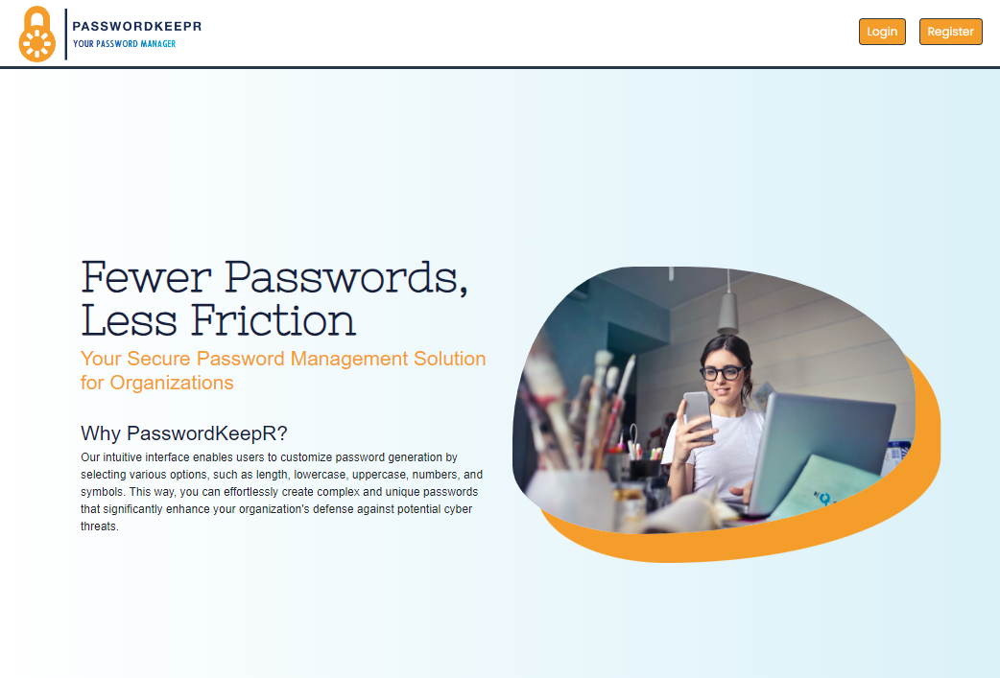

# :closed_lock_with_key: - PasswordKeepR

# About Our App _PasswordKeepR_
Introducing our cutting-edge password management solution designed for organizations like Lighthouse Labs – an efficient password storage system called **PasswordKeepR**. This app enables authorized users to access all the organization's passwords conveniently. With **PasswordKeepR**, users can _generate_ new passwords for specific accounts based on customizable options available in the form. These options include password length, lowercase letters, uppercase letters, numbers, and symbols.

Navigating the hassle of logging in to various websites becomes a breeze with our app. When a user needs to access a particular website, like Facebook, they can simply locate the relevant password within **PasswordKeepR**. By clicking a button, the password is automatically copied to the clipboard, streamlining the login process. Rest assured, **PasswordKeepR** keeps your sensitive information secure and easily accessible for smooth business operations. Say goodbye to password management headaches and safeguard your organization and personal accounts with **PasswordKeepR** today!

## Contributors
This impressive app, which I, Madiha Waqar along with Mithra Perera and Nick Ferracuti, contributed to, is a product of our midterms in the Lighthouse Labs Web Development Flex Program curriculum. 

<a href="https://github.com/MithraPerera/passwordkeepr/graphs/contributors">
  
</a>

[Madiha Waqar](https://www.linkedin.com/in/madiha-waqar-a8253827/)
[Nick Ferracuti](https://github.com/NFerracuti)
[Mithra Perera](https://github.com/MithraPerera)

## Tech Stack
**PasswordKeepR** is _full-stack application_ that uses `PostgreSQL` relational database system and `Express` to manage the backend. Front-end has been build using bootstrap framework along with `EJS, CSS, SASS and Javascript`. 

<p align="center">
  <a href="https://skillicons.dev">
    
  </a>
</p>

## :traffic_light: Dependencies
  ```
    "bcrypt": "^5.1.0",
    "cookie-session": "^2.0.0",
    "dotenv": "^2.0.0",
    "ejs": "^2.6.2",
    "express": "^4.17.1",
    "morgan": "^1.9.1",
    "pg": "^8.5.0",
    "sass": "^1.35.1"
  ```

## :seedling: ERD


## :triangular_flag_on_post: Getting Started

Clone the repo onto your local device. 
## Database & Application Setup
- Create the .env by using `.env.example` as a reference: `cp .env.example .env`
- Update the .env file with your correct local information
  - username: `labber`
  - password: `labber`
  - database: `midterm`
  - host: `localhost`
- Install dependencies: `npm i`
- Fix to binaries for sass: `npm rebuild node-sass`
- Start the PostgreSQL server by using the `psql` command in terminal
- Create database and tables using node-postgres
  ``` psql
    CREATE DATABASE midterm;
    \c midterm 
    ```
- Reset database: `npm run db:reset`
- Run the server: `npm run local`

## :dart: Requirements & Features
- user can be assigned to an organization
- an organization has many users
- user can add a new username and password for a specific website
- app can generate passwords based on the criteria specified (password length, contains lowercase,  contairs uppercase, contains numbers, etc)
- user can edit and change their password any time
- user can conveniently copy password to clipboard so they dont have to select the password
- sites can be categoried, to, social (fb, linkedin), work related (bamboo, harvest), entertainment (snapchat, reddit), etc, etc
 
## App Feature Screenshots

- Landing Page



- Authenticated user enters the application dashbaord to access their organizations and personal accounts


- Password filteration based on categories


- Create new accounts / Generate new passwords


- Copy/Edit/Delete Password


## :clap: Thank you for your interest!
Working on PasswordKeepr was an undeniably awesome experience. Throughout the project, we gained a tremendous amount of knowledge about frontend-backend integration with a database and honed our skills in group collaboration, from the initial planning stages to the final presentation. This application undoubtedly boosted our confidence to venture into new territories and create even more exciting apps!
Thankyou for visiting!

------------------------------------------------------------------------------------------------